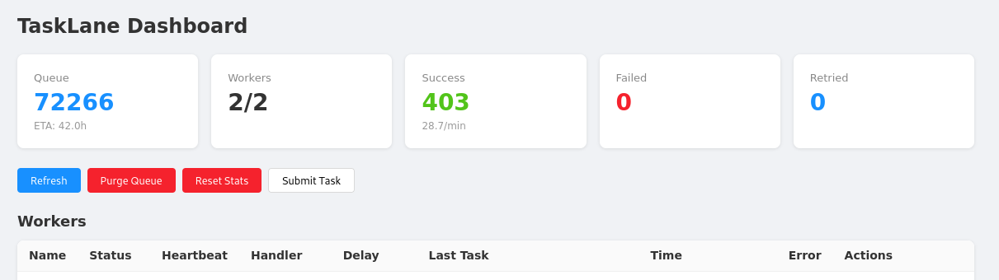

<p align="center">
  <h1 align="center">🛤️ TaskLane</h1>
  <p align="center">
    <strong>Push a function to Redis. Workers run it. Zero deployment.</strong><br>
    只需把一个函数推送到 Redis，Worker 自动执行，零部署。
  </p>
</p>

<p align="center">
  
  
  
</p>

---

TaskLane is a minimalist distributed task framework built on Redis. Unlike traditional task queues where you deploy code to every worker, TaskLane distributes **the code itself** through Redis — workers are blank execution engines that pull and run whatever you push.

```
  📝 You write a function     📦 Redis stores code + tasks     🏃 Workers execute
  ┌───────────────────┐      ┌────────────────────────┐      ┌──────────────────┐
  │ def handle(p):    │ ───► │ handler: source code   │ ───► │ Worker 1  ✅     │
  │   return {result} │      │ queue: task1,task2,... │      │ Worker 2  ✅     │
  └───────────────────┘      └────────────────────────┘      │ Worker N  ✅     │
                                                             └──────────────────┘
```

## ✨ Features

| | Feature | What it means |
|---|---------|--------------|
| 🚀 | **Zero-Deploy Code Distribution** | Push a Python function to Redis — all Workers execute it instantly. No file copy, no Docker rebuild, no restart. |
| 🛤️ | **Light-weight Task Queue** | Pure Redis LPUSH/BRPOP queue. No Celery, no RabbitMQ, no heavy dependencies. |
| 🔄 | **Hot-Swap Handlers** | Register a new handler and Workers pick it up on the next task. Switch what your cluster does in seconds. |
| 🖥️ | **CLI-First** | Start Workers, register handlers, submit tasks, control everything from the terminal. |
| 📊 | **Live Dashboard** | Speed, ETA, per-worker control, event log, stats — all in a built-in web panel. |

---

## 🚀 Getting Started

Prerequisites: **Python 3.10+** and a **Redis** server accessible from all machines.

### Step 1: Install

```bash
# 🖥️ Master machine (submit tasks + monitor)
pip install "tasklane[dashboard] @ git+https://github.com/Anstarc/TaskLane.git"

# 🏃 Worker machines (execute tasks only)
pip install "tasklane @ git+https://github.com/Anstarc/TaskLane.git"
```

### Step 2: Write a handler

On the Master machine, create `./handlers/add.py`:

```python
def handle(params: dict) -> dict:
    return {"sum": params["a"] + params["b"]}
```

> 📝 **Handler rules:** function named `handle`, takes `dict`, returns `dict`. Put imports inside the function body.

### Step 3: Register + submit (on Master)

```bash
# 📦 Push handler code to Redis
tasklane register add ./handlers/add.py --redis redis://your-redis:6379/0

# 🚀 Submit tasks
tasklane submit add '{"a": 1, "b": 2}' --redis redis://your-redis:6379/0
tasklane submit add '{"a": 10, "b": 20}' --redis redis://your-redis:6379/0
```

### Step 4: Start Workers

```bash
# 🏃 On worker machine 1
tasklane worker --name w1 --redis redis://your-redis:6379/0

# 🏃 On worker machine 2
tasklane worker --name w2 --redis redis://your-redis:6379/0
```

Workers connect to Redis, pull the handler code, execute tasks, store results. **No files need to be copied to Worker machines.**

### Step 5: Open Dashboard

```bash
# 📊 On Master
tasklane dashboard --port 5000 --redis redis://your-redis:6379/0
# Open http://localhost:5000
```

🎉 **That's it.** You have a distributed task system running.

---

## 🔄 Hot-Swap: Switch Tasks in Seconds

This is TaskLane's killer feature. Want your Workers to do something completely different?

```bash
# 📝 Write a new handler
cat > ./handlers/crawl.py << 'EOF'
def handle(params: dict) -> dict:
    import requests
    resp = requests.get(params["url"])
    return {"status": resp.status_code, "length": len(resp.text)}
EOF

# 📦 Register it (with dependencies)
tasklane register crawl ./handlers/crawl.py --deps requests --redis redis://your-redis:6379/0

# 🚀 Submit tasks — Workers pick up the new code automatically
tasklane submit crawl '{"url": "https://example.com"}' --redis redis://your-redis:6379/0
```

No restart. No redeployment. Workers just start running the new code.

---

## 🖥️ CLI Reference

`--redis` and `--ns` go **after** the subcommand.

| Command | Description |
|---------|-------------|
| 🏃 `worker --name w1` | Start a Worker |
| 📊 `dashboard --port 5000` | Start the web Dashboard |
| 📦 `register NAME file.py --deps pkg1,pkg2` | Register a handler from file |
| 🚀 `submit NAME '{"key":"val"}'` | Submit a task |
| 📋 `handlers` | List registered handlers |
| 🗑️ `remove-handler NAME` | Remove a handler |
| 📈 `monitor` | Real-time stats (Ctrl+C to exit) |
| ⏱️ `set-delay --min 1 --max 3 [--worker w1]` | Set delay config (global or per-worker) |
| ⏸️ `pause --worker w1` | Pause a Worker |
| ▶️ `resume --worker w1` | Resume a Worker |
| 🧹 `purge` | Clear the task queue |

```bash
# Example
tasklane worker --name w1 --redis redis://10.0.0.1:6379/0 --ns myproject
```

---

## 📊 Dashboard

Built-in web panel for monitoring and control:



- 📈 **Stats cards** — queue depth, speed (tasks/min), ETA, success/failure/retry counts, active Workers
- 🏃 **Worker table** — status, heartbeat, current handler, per-worker delay config, pause/resume buttons
- 📦 **Handler management** — view source, upload, delete
- 📋 **Event log** — task results with readable IDs, clear button to purge history
- ⏱️ **Delay config** — global and per-worker throttling from the browser
- 🚀 **Task submission** — submit tasks directly from the browser
- 🔄 **Reset stats** — zero out counters with one click

### display_fields

Control which result fields appear in the event log:

```python
master.register_handler("pi", func, display_fields=["inside", "total"])
# Event log: pi: inside=392718, total=500000
```

---

## 🐍 Python API (Advanced)

For batch submission, result collection, and programmatic control.

```python
from tasklane import Master

master = Master(redis_url="redis://your-redis:6379/0")

# Register handler from a function (auto-extracts source code)
def my_task(params: dict) -> dict:
    return {"result": params["a"] + params["b"]}

master.register_handler("add", my_task, display_fields=["result"])

# Submit + collect results
ids = master.submit_bulk("add", [{"a": i, "b": i} for i in range(100)])
results = master.collect_results(ids, timeout=300)  # {task_id: result_dict}

# Real-time result consumption (BRPOP)
item = master.pop_result(timeout=5)  # {"task_id": ..., "result": ...} or None

# Single result
result = master.get_result(task_id)  # dict or None

# Delay control (global or per-worker)
master.set_delay(min_delay=1, max_delay=3)
master.set_delay(worker="w1", min_delay=5)

# Worker control
master.pause(worker="w1")
master.resume(worker="w1")
master.stop(worker="w1")
master.purge()

# Monitoring
master.get_workers()    # [{name, status, alive, handler, ...}]
master.get_stats()      # {success, failed, retried}
master.get_events()     # [{time, worker, task_id, event, detail}]
master.queue_len()
```

Start a Worker with callbacks (alternative to CLI):
```python
from tasklane import Worker

worker = Worker(redis_url="redis://host:6379/0", name="w1")

@worker.on_success
def on_ok(task_id, handler, params, result):
    print(f"Done: {task_id}")

worker.run()
```

---

## 📂 Examples

See [examples/](examples/):

| File | Description |
|------|-------------|
| `demo.py` | 🧪 Master + Worker in one process (quick testing) |
| `distributed_pi.py` | 🥧 Distributed Monte Carlo Pi estimation |
| `echo_handler.py` | 📝 Minimal handler file |
| `crawl_handler.py` | 🌐 Handler with dependencies (requests + bs4) |

---

## 🏗️ Architecture

```
┌──────────────┐          Redis           ┌──────────────┐
│  🖥️ Master   │◄────────────────────────►│ 🏃 Worker 1  │
│              │   tl:handler:{name}      │              │
│ register()   │   tl:queue:default       │  BRPOP loop  │
│ submit()     │   tl:delay_config        │  exec(code)  │
│ pop_result() │   tl:delay:{worker}      │  heartbeat   │
│ set_delay()  │   tl:worker:*            │  auto deps   │
│ dashboard    │   tl:events              │  signal safe │
└──────────────┘   tl:stats               ├──────────────┤
                   tl:results:*           │ 🏃 Worker N  │
                   tl:result_queue        └──────────────┘
                   tl:control:*
```

## 📋 Dependencies

- 🐍 Python >= 3.10
- 🔴 Redis >= 4.0
- 🌐 Flask >= 2.0 (Dashboard only)

## 📄 License

MIT
